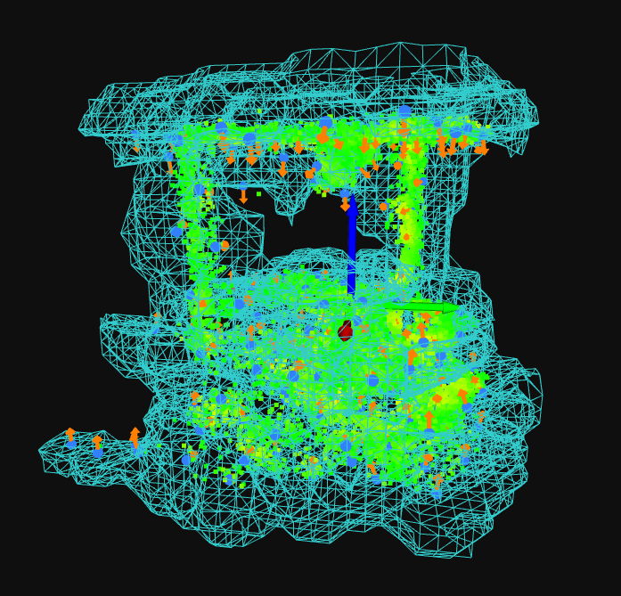

# TurtleBot Tracker

**3D LiDAR-based detection and tracking of TurtleBot2 in sparse point clouds**

---

## Overview

This repository provides a complete pipeline for detecting and tracking a TurtleBot2 robot in real-time using a static LiDAR sensor (Livox MID-360). The system operates in two phases:

- **Offline**: Build a compact implicit surface model (Hermite‑GPIS‑W) of the robot and a static background map from a stationary capture sequence.



- **Online**: Segment incoming LiDAR frames, register the robot model against candidate clusters, and track its pose in SE(2) with a robust EKF.

The pipeline is designed for low‑density, non‑repetitive LiDAR patterns and achieves real‑time performance without neural networks or heavy GPU dependencies.

---

## Features

- **Range‑image segmentation** – O(N) connected‑component extraction with angular continuity checks.
- **Adaptive hull filtering** – volume and solidity thresholds that adjust to point‑count and range.
- **Hermite‑GPIS‑W surface model** – compact, differentiable implicit field with Wendland kernels and uncertainty quantification.
- **GMM‑based pose registration** – direct SE(2) fitting with rotated covariances, intensity likelihood, and trimmed‑EM for outlier robustness.
- **EKF tracking** – constant‑velocity model on SE(2) with ZUPT (zero‑velocity updates) and a finite‑state machine for lost/recovery handling.
- **Full offline + online toolchain** – from static map construction to real‑time visualisation.

---

## Requirements

- **Python** ≥ 3.10
- **Conda** (recommended)
- Dependencies listed in `requirements.txt` (see installation below)

---

## Installation

### 1. Clone the repository

```bash
git clone https://github.com/your-org/turtlebot_tracker.git
cd turtlebot_tracker
```

### 2. Create and activate a Conda environment

```bash
conda create -n turtlebot python=3.10 -y
conda activate turtlebot
```

### 3. Install dependencies

```bash
pip install -r requirements.txt
```

### 4. Prepare the data

Download or copy the ROS bag files (`.mcap`) into the `data/bags/` directory.  
The expected structure is:

```
data/bags/
├── rosbag2_2026_06_27-18_27-static_1m/
│   └── *.mcap
├── rosbag2_2026_06_27-18_43-mov_01/
│   └── *.mcap
└── ... (other bags)
```

---

## Usage

The pipeline is split into two stages: **offline model building** (run once per environment/robot) and **online tracking** (run per bag).

### Offline Phase (Model Building)

| Step | Command | Description |
|------|---------|-------------|
| 1 | `python tools/select_canonical_candidate.py` | Accumulates frames from the static bag, clusters obstacles, filters candidates, and lets you select the robot cluster (manual or auto). Outputs `static_full.npz` and `static_metadata.json`. |
| 2 | `python tools/build_implicit_model.py` | Builds the Hermite‑GPIS‑W implicit surface model from the labelled robot points. Outputs `config/implicit_model.json`. |
| 3 | `python tools/visualize_implicit_model.py` | (Optional) Visualises the implicit surface wireframe with error heatmap over the robot points. |
| 4 | `python tools/build_static_map.py` | Constructs a compact static background map (ground + structural shells) from the accumulated static data. Outputs `config/static_map_prior.json`. |
| 5 | `python tools/visualize_static_map.py` | (Optional) Visualises the static map shells and ground plane. |

#### Example (run all steps)

```bash
python tools/select_canonical_candidate.py --auto
python tools/build_implicit_model.py
python tools/build_static_map.py
```

> **Note**: The first step (`select_canonical_candidate.py`) opens a 3D viewer if `--auto` is not provided. You can visually select the robot cluster from the list of candidates.

---

### Online Phase (Tracking & Visualisation)

Once the offline models exist, run the tracker on any test bag:

```bash
python tools/visualize_online_segmentation.py \
    --bag data/bags/rosbag2_2026_06_27-18_43-mov_01/rosbag2_2026_06_27-18_43_36_0.mcap
```

This will:
- Apply the static background veto (ground + walls from the prior)
- Segment point clouds into candidate clusters
- Register each candidate against the implicit robot model
- Select the best‑scoring candidate using a MAP criterion
- Update the EKF and display the tracked pose in real‑time

#### Command‑line options

| Flag | Default | Description |
|------|---------|-------------|
| `--bag` | *required* | Path to the `.mcap` bag file or directory containing it |
| `--prior` | `config/static_map_prior.json` | Static map prior file |
| `--metadata` | `data/outputs/static_metadata.json` | Metadata from offline build |
| `--model` | `config/implicit_model.json` | Implicit model file |
| `--fps` | `10.0` | Playback rate (frames per second) |

---

## Key Components

| Module | Description |
|--------|-------------|
| `preprocessor.py` | Voxel downsampling, ground plane alignment via RANSAC, and static veto using the prior map. |
| `segmentation.py` | Range‑image based connected‑component segmentation (O(N)) – used offline. |
| `online_segmenter.py` | Online segmentation with static background veto and DBSCAN clustering. |
| `candidate_filter.py` | Cascade of hull volume, solidity, dihedral test, volumetricity and soft‑extent likelihood. |
| `implicit_surface.py` | Hermite‑GPIS‑W model: offline building, adaptive bandwidth, and fast evaluation with KD‑tree pruning. |
| `registration.py` | Direct SE(2) pose registration via Gauss‑Newton optimisation over the implicit field, with multi‑start and Huber weighting. |
| `tracking.py` | EKF on SE(2) with ZUPT and a finite‑state machine for life‑cycle management. |
| `static_map.py` | Representation of ground plane and structural shells from offline accumulation. |
| `geometry.py` | OBB fitting, gap‑based splitting, and box intersection utilities (offline). |
| `mvi_clustering.py` | Minimum Volume Increase (MVI) hierarchical clustering for offline segmentation. |

---

## Configuration

All tunable parameters are in `config/default_params.yaml`. Key categories:

- **Preprocessing**: voxel size, RANSAC iterations, blind‑spot radius.
- **Segmentation**: angular bins, beta threshold, DBSCAN eps/min_points.
- **Candidate filter**: adaptive volume/solidity, dihedral thresholds, extent likelihoods.
- **Registration**: GN iterations, Huber margin, number of angular starts.
- **Tracking**: process/measurement noise, ZUPT thresholds, FSM timeouts.

Calibrate these values against your own bag data for best performance.

---

## Outputs

### Offline outputs

| File | Description |
|------|-------------|
| `data/outputs/static_full.npz` | Labelled point cloud (ground, structure, robot) |
| `data/outputs/static_metadata.json` | Ground height, alignment matrix, robot centroid |
| `config/implicit_model.json` | Compressed Hermite‑GPIS‑W model (primitives + Cholesky factors) |
| `config/static_map_prior.json` | Static background shells + ground plane |

### Online outputs

- Visualisation window showing:
  - Ground (dark blue) and walls (grey)
  - Candidate clusters (cyan)
  - Accepted robot cluster (green)
  - Tracked bounding box and trajectory (red)
- Console log with frame index, FSM state, health score, and pose (X, Y, Yaw)

---

## Acknowledgements

This work builds upon established methods in:

- Range‑image segmentation (Bogoslavskyi & Stachniss, 2016)
- Gaussian‑process implicit surfaces (Williams & Fitzgibbon, 2007)
- Log‑GPIS (Le Gentil et al., 2021)
- Generalised‑ICP (Segal et al., 2009)
- NDT / surfel‑based surface representation

The implementation is self‑contained, uses no deep‑learning frameworks, and runs entirely on CPU.

---

## License

[MIT](LICENSE) – feel free to use and modify for your own research or applications.
```