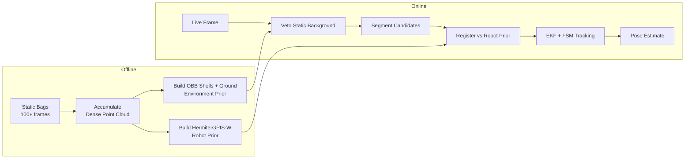
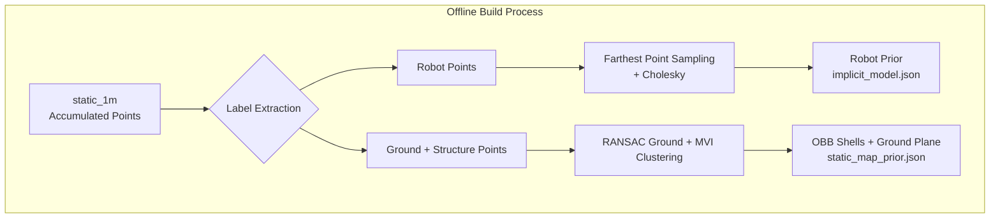
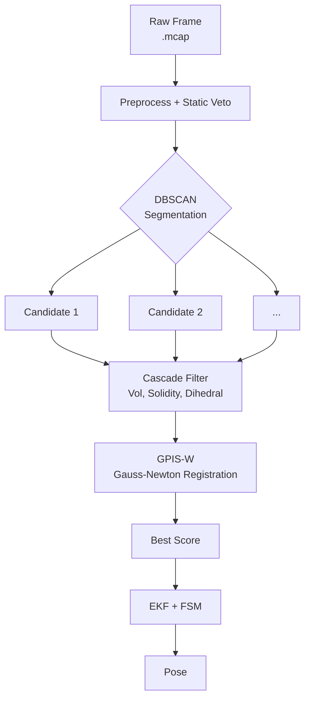

# Design Overview - TurtleBot Tracker

**A robust, real‑time detection and tracking system for a TurtleBot2 using a static Livox MID‑360 LiDAR.**

## 1. Introduction

This document provides a engineering overview of the TurtleBot Tracker pipeline. The system is designed to detect and track a TurtleBot2 robot operating in a static indoor environment, using only a single fixed LiDAR sensor. The implementation runs entirely on CPU, uses no deep learning frameworks, and is structured as a two‑stage process:

1.  **Offline Stage**: Builds compact, high‑confidence priors of the robot and the static background.
2.  **Online Stage**: Uses these priors to perform fast, low‑latency detection and pose tracking.

The following sections detail the physical constraints that drove the architecture, the specific algorithms chosen, and the rationale behind each design decision, referencing the exact source files where each component is implemented.

---

## 2. System Constraints and Requirements

The entire system design is dictated by a fixed set of physical and operational constraints. Every algorithmic decision stems from these boundaries:

- **Static Sensor**: The LiDAR unit is fixed. The ground plane and environmental geometry (walls, furniture) do not change over time.
- **Non‑Repetitive Scanning Pattern**: The Livox MID‑360 employs a non‑repetitive Lissajous-style scanning pattern. Consecutive frames sample different subsets of the scene. This property is essential for the offline accumulation strategy: because each frame provides a slightly different set of points on the robot's surface, we can fuse hundreds of frames to build a dense prior, effectively filling in the gaps left by a single frame.
- **Extreme Sparsity**: The robot typically returns only 20 to 150 points per frame. This low density makes it statistically impossible to estimate the robot's shape and pose simultaneously from a single frame.
- **Distance‑Dependent Noise and Density**: Both the measurement noise and the spatial density of points vary with range. Filters must adapt to this variability.
- **Static Background**: The room and furniture are stationary. We can construct a high‑confidence model of the background once and reuse it indefinitely.
- **Known Bounds**: The robot's physical dimensions (height, diameter) are known a priori, but no exact CAD model or mesh is available.
- **Real‑Time Operation**: The entire online pipeline (from raw frame to estimated pose) must execute in under 100 ms on a standard CPU.
- **No External Ground Truth**: Validation must rely on self‑consistency metrics (e.g., filter innovation, trajectory smoothness).

---

## 3. Core Strategy: Decouple Form and Pose

Given the extreme sparsity, attempting to estimate both the robot's shape and its pose online from a single frame is a fundamentally ill‑posed problem. The solution adopted here is to **decouple these two tasks**:

1.  **Offline**: Use abundant data (accumulated static frames) to build a compact, differentiable shape prior of the robot (`Hermite-GPIS-W`). The shape is frozen and never re‑estimated online.
2.  **Online**: Only estimate the 3 degrees of freedom of the robot's pose ($x, y, \psi \in SE(2)$) by registering the online point cloud against the fixed offline prior.

This separation reduces the online problem to a non‑linear least‑squares optimisation with a small parameter space, making it both fast and robust.

---

## 4. Offline Stage: Building the Priors

The offline stage uses the `static_1m` bag (and strictly this bag, for the current implementation). Due to time constraints, the `rot_*` bags were not used. However, the robot's symmetric and hollow structure, combined with the non‑repetitive scanning pattern, allows sufficient points to pass through the tower and chassis gaps, providing a reliable prior covering more than half of the visible surface. This has proven sufficient for stable registration.

### 4.1 Robot Model: Hermite-GPIS-W

The robot's shape is represented as a continuous implicit field $f: \mathbb{R}^3 \to \mathbb{R}$, where the zero‑level set $\{ \mathbf{x} \mid f(\mathbf{x}) = 0 \}$ defines the robot's surface. We use a **Hermite Gaussian Process Implicit Surface with Wendland kernels (Hermite‑GPIS‑W)**, implemented in `src/turtlebot_tracker/core/implicit_surface.py`.

- **Why an Implicit Field**: A surface is a 2D manifold. An implicit field naturally represents shells, handles non‑convex geometries (base + tower), and separates the "air" between parts without assigning probability to it.
- **Hermite Observations**: We use both the position ($f(\mathbf{p}_i)=0$) and the normal ($\nabla f(\mathbf{p}_i)=\mathbf{n}_i$) of each sampled point. This fixes the sign (inside/outside) without requiring artificial "ghost" points.
- **Wendland C² Kernel**: The kernel has strict compact support (radius $h$). Points farther than $h$ have exactly zero influence on each other. This prevents contamination between disconnected parts (e.g., the base and the tower) and guarantees a well‑conditioned system matrix.
- **Adaptive Bandwidth**: The radius $h_i$ is not global. It is computed locally using the Von Mises–Fisher concentration $\bar{R}_i$ of neighbouring normals. If normals are aligned (flat surface), $h_i$ stays large. If they are scattered (edge or high curvature), $h_i$ shrinks to the sensor's physical resolution, preserving sharp edges.
- **Compression**: The dense cloud (~12,000 points) is compressed to $M \approx 150$–$200$ primitives using Farthest Point Sampling and Cholesky factorisation. This keeps the online evaluation ($O(M)$) extremely fast.

### 4.2 Environment Model: Ground and Structural Shells

The environment is represented as a set of geometric primitives for fast background veto, built in `tools/build_static_map.py`.

- **Ground Plane**: A single plane is fitted using RANSAC on the accumulated ground points.
- **Structural Elements (Walls, Furniture)**: The remaining static points are clustered using **Minimum Volume Increase (MVI) hierarchical clustering** (`src/turtlebot_tracker/core/mvi_clustering.py`). MVI merges neighbouring clusters based on the smallest increase in the determinant of their combined covariance (i.e., the increase in occupied volume). This produces a set of compact, convex **Oriented Bounding Boxes (OBBs)**.
    - The OBBs are then merged using a geometric overlap criterion to reduce the total number of shells.
    - These shells act as a coarse, low‑complexity mask. Online, any point falling inside these OBBs is immediately discarded as background.

---

## 5. Online Stage: Detection and Tracking Pipeline

The online pipeline processes each frame sequentially, applying a cascade of increasingly expensive operations to filter out background and false positives before performing pose registration.

### 5.1 Preprocessing and Static Veto

*(`src/turtlebot_tracker/core/preprocessor.py`)*

- The raw point cloud is voxel‑downsampled to reduce noise.
- Rodrigues alignment (computed offline) is applied to bring the ground plane parallel to the $Z=0$ plane.
- **Static Veto**: For each point, the distance to the ground plane and to each OBB shell is computed. If a point lies within the ground thickness or inside a shell, it is labelled as background and discarded. This step removes 80‑90% of the points, dramatically reducing the load on subsequent stages.

### 5.2 Segmentation and Cascade Filter

*(`src/turtlebot_tracker/core/online_segmenter.py` and `src/turtlebot_tracker/core/candidate_filter.py`)*

The remaining obstacle points are clustered using **DBSCAN** (from Open3D) to form candidate clusters. Each candidate then passes through a cascade of hard and soft filters:

- **Adaptive Hull Volume**: The convex hull volume $V_{\text{hull}}$ is computed. It must satisfy $V_{\min}(N, r) \le V_{\text{hull}} \le V_{\max}$, where $V_{\max}$ is derived from the offline robot model scaled by $\kappa_{\text{vol}} \approx 1.2$. $V_{\min}$ grows with the number of points $N$ and the range $r$, preventing the rejection of small, dense clusters.
- **Adaptive Solidity**: $\rho = N / V_{\text{hull}}$. A minimum solidity threshold is computed using a logistic function of $N$. This prevents large, hollow structures (like partial walls) from passing through.
- **Dihedral Test**: A sequential 2‑plane RANSAC is performed. If two planes explain more than 88% of the points and the angle between their normals lies between 60° and 120°, the cluster is classified as a structural corner (e.g., a wall) and rejected.
- **Volumetricity and Extents**: A soft likelihood score is computed based on the eigenvalues of the covariance matrix and the cluster's physical dimensions relative to the expected robot size. This is added as an extra term to the final registration score, rather than acting as a hard cutoff.

### 5.3 Pose Registration: GPIS-W Gauss‑Newton

*(`src/turtlebot_tracker/core/registration.py`)*

This is the core of the online system. It estimates the robot's pose by minimising the geometric error against the offline implicit surface.

- **Cost Function**: We minimise $E(\boldsymbol{\xi}) = \sum_j \frac{f(T_{\boldsymbol{\xi}}(\mathbf{q}_j))^2}{\text{Var}[f] + \sigma_{\text{LiDAR}}^2}$, where $T_{\boldsymbol{\xi}}$ is the SE(2) transformation. The denominator acts as an uncertainty‑aware weighting.
- **Optimiser**: We use **Gauss‑Newton (GN)** with analytical Jacobians (derivative of the implicit field $\nabla f$ and the transformation derivatives). GN converges in 3‑5 iterations because the parameter space is only 3‑dimensional ($x, y, \psi$).
- **Multi‑Start**: To avoid local minima due to the robot's symmetry, 8 initial yaw angles are tested. Only the top 2 seeds are refined by GN, saving computation.
- **Robust Loss**: Huber weighting is applied to the residuals to down‑weight outliers (e.g., points from occluding objects accidentally attached to the cluster).

**Note on GMM/EM**: Contrary to some earlier experimental branches, the current registration implementation **does not use Gaussian Mixture Models or Expectation‑Maximisation**. It relies purely on the deterministic, least‑squares fitting of points to the GPIS‑W field, as this is faster and more numerically stable for our sparse data.

### 5.4 Tracking: EKF, ZUPT, and Finite‑State Machine

*(`src/turtlebot_tracker/core/tracking.py`)*

The raw pose estimates from the registration are filtered temporally using an Extended Kalman Filter (EKF) on SE(2).

- **State**: $[x, y, \psi, v_x, v_y, \omega]^T$. A constant‑velocity process model is used.
- **Measurement Update**: The EKF distinguishes between two types of measurements passed from the registration stage:
    1.  **`is_target=True`** (Target Measurement): The registration score is very low (excellent fit). The measurement is trusted with high confidence, and the state is strongly pulled towards it.
    2.  **`is_target=False`** (Best‑Rejected Measurement): The registration score is acceptable but not excellent. The measurement is only accepted if it passes a **Mahalanobis gating** test against the predicted state. This enforces kinematic continuity and penalises unrealistic jumps between clusters, ensuring smooth tracking even with noisy inputs.
- **ZUPT (Zero‑Velocity Update)**: When the estimated velocity is low and the position variance is small, the robot is assumed to be stationary. Instead of freezing the position, a pseudo‑measurement updates the velocity towards zero using the Kalman gain. This prevents positional drift during stops without introducing a hard reset.
- **Finite‑State Machine (FSM)**: The tracker operates in four states to avoid reporting invalid poses:
    - `UNINITIALIZED`: Initial start‑up.
    - `SEARCHING`: Looking for a target. No pose is published.
    - `ACTIVE_TRACKING`: A valid target is being tracked.
    - `COASTING`: The target has been temporarily lost, but the EKF continues to predict (coast) for a short period. If the target reappears, it transitions back to `ACTIVE_TRACKING`; otherwise, it times out to `SEARCHING`.

---

## 6. Validation and Diagnostic Metrics

Since no external ground truth is available, the system relies on self‑consistency metrics to validate its performance. These metrics are logged and can be analysed using `tools/analyze_results.py`.

- **NIS (Normalised Innovation Squared)**: The squared Mahalanobis distance between the measurement and the predicted state. Under correct filter tuning, NIS should follow a $\chi^2_3$ distribution. This metric validates the consistency of the EKF.
- **GN Energy Decay (Monotonicity)**: The cost function value of the Gauss‑Newton solver must strictly decrease at each iteration. If the energy fails to decrease, it indicates a numerical instability or a poor initialisation.
- **Ground Z‑Residual**: The calculated $Z$ height of the tracked robot must be exactly `Z_ground + robot_half_height`. This residual is always zero by construction (algebraic), and any deviation signals a bug in the preprocessing alignment.
- **FSM State Distribution**: The percentage of time spent in `SEARCHING`, `ACTIVE_TRACKING`, and `COASTING` provides a direct measure of robustness. A well‑behaved system spends most of its runtime in `ACTIVE_TRACKING`.
- **Background Veto Rate**: The proportion of points removed by the static map veto. A stable rate indicates that the offline environment prior is still valid.

---

## 7. Future Work

While the current implementation provides a robust baseline, several avenues for improvement are identified:

- **Enhanced Robot Prior**: Currently, only the `static_1m` bag is used to build the robot model. Using the `rot_*` bags (rotating the robot) would provide a full 360° view, drastically reducing the model's uncertainty on the occluded side and improving yaw estimation.
- **Radiometric Fusion**: The `sh_c0` (intensity) features are currently computed offline but not used in the online registration cost function. Integrating radiometric cues into the Gauss‑Newton residual (using a joint spatial‑intensity likelihood) could help disambiguate symmetrical parts, particularly for yaw estimation.
- **Online Model Learning (Low‑Rank Updates)**: The current offline model is static. By leveraging the Woodbury matrix identity or Cholesky updates, the GPIS‑W model could be incrementally updated online with high‑confidence observations. This would allow the system to adapt to permanent changes in the robot (e.g., added payload) or refine the shape prior over time.
- **Yaw Stability Improvement**: Due to the robot's symmetry and the single‑view prior, yaw estimation sometimes exhibits jitter. This could be mitigated by incorporating a von Mises‑Fisher prior on the heading over time, or by using a multi‑hypothesis tracker that explicitly handles symmetrical ambiguities.
- **Full Online Re‑estimation of Background**: Currently, the background is static. If the environment changes (e.g., furniture moved), the pipeline would need to be rerun offline. A long‑term background update mechanism would increase deployability.

---

## 8. References

- Bogoslavskyi, I., & Stachniss, C. (2016). *Fast range image‑based segmentation of sparse 3D laser scans for online operation*. IROS.
- Williams, O., & Fitzgibbon, A. (2007). *Gaussian Process Implicit Surfaces*. GP in Practice Workshop.
- Le Gentil, C., et al. (2021). *Faithful Euclidean Distance Field from Log‑Gaussian Process Implicit Surfaces*. IEEE RA‑L.
- Wendland, H. (1995). *Piecewise polynomial, positive definite and compactly supported radial functions of minimal degree*. Adv. Comp. Math.
- Segal, A., Haehnel, D., & Thrun, S. (2009). *Generalized‑ICP*. RSS.
